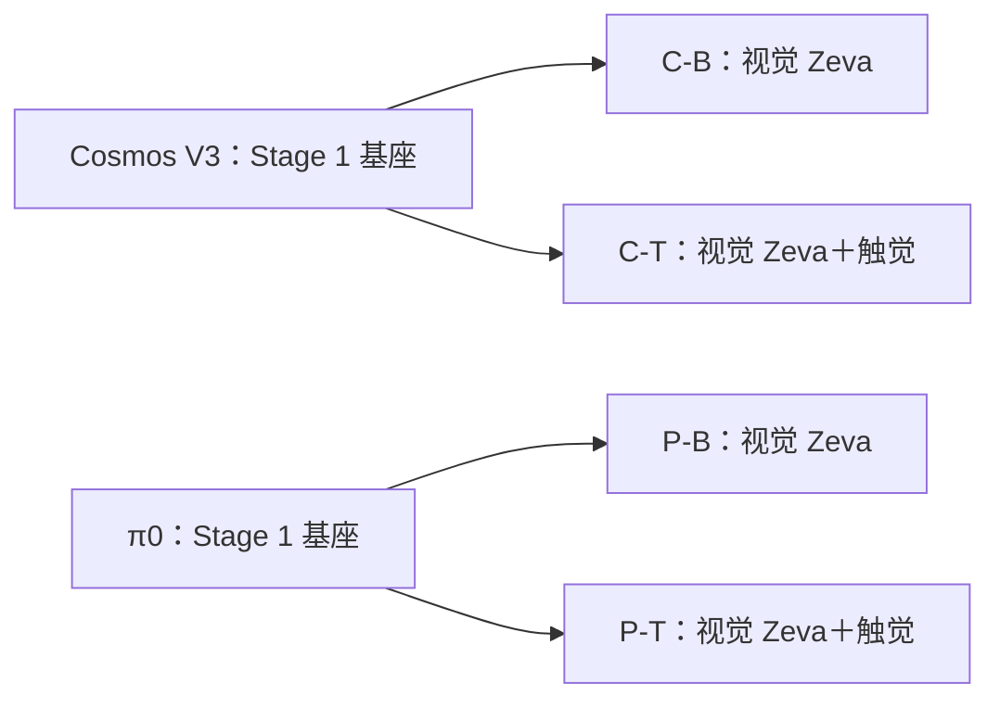

# Cosmos / π0：四模型训练与真机对照方案

更新：2026-09-25。主实验固定为四个最终策略，分别测量两条骨干加入触觉后的收益。按已确认的方案复用 CTE v4，不安排 CTE 重训，最终评价使用新的真机执行轨迹。

## 四个最终模型

这里的 **baseline 指无触觉的视觉 Zeva Stage 2**。它和触觉版拥有相同的视觉 CTE、动作先验和对应骨干的适配层。仓库中名为 `configs/pi0/xhand_baseline.json` 的配置属于前置 Stage 1 基座，不是下表的最终 π0 baseline。

| 编号 | 最终模型 | 视觉 CTE / 动作先验 | 触觉分支 | 初始化 |
|---|---|---|---|---|
| C-B | Cosmos-based baseline | 有 | 无 | 固定的 Cosmos V3 joint18 基座 |
| C-T | Cosmos-based tactile | 与 C-B 相同 | 单帧冻结 encoder＋30帧 BIT＋effect residual | 与 C-B **同一个**基座 checkpoint |
| P-B | π0-based baseline | 有 | 无 | 固定的 π0 XHand joint18 基座 |
| P-T | π0-based tactile | 与 P-B 相同 | 与 C-T 相同结构、来源和输入契约 | 与 P-B **同一个**基座 checkpoint |

若直接拿 Stage 1 纯基座对比带 CTE 的触觉 Stage 2，差异同时包括视觉记忆、动作先验、额外训练和触觉，不能将收益单独归因于触觉。两个 Stage 1 checkpoint 保留为初始化与诊断资源，不增加本轮主实验模型的种类。



每条骨干的两个 Stage 2 分支独立开始训练；触觉分支不从已经多训练了若干步的视觉分支继续训练。

## 训练内容、预算和初始化

| 项目 | 固定安排 |
|---|---|
| Stage 1 | 每种骨干一份 XHand joint18 基座；首轮目标5000次 optimizer update、有效全局 batch 112 |
| Stage 2 | 四个模型各2000次 optimizer update、有效全局 batch 112，每个模型224,000次窗口采样 |
| 基座冻结 | 每对 Stage 2 均冻结完全相同的基座权重 |
| 视觉 baseline 的可训练模块 | Cosmos：PBD、动作适配器、global projector；π0：PBD、动作适配器 |
| 触觉版额外可训练模块 | tactile projector、BIT、finger projection/effect head、effect gate |
| 冻结共享资源 | 视觉 CTE v4、Wan VAE、触觉 patch encoder |
| 数据划分 | 所有策略使用 seed42 的同一98/3 episode划分和同一有效窗口集合；此处seed是**数据划分seed** |
| 训练随机种子 | 保留现有Cosmos Stage 1的seed0；π0 Stage 1计划显式用seed0。四个Stage 2首轮统一seed42 |
| 保存与模型选择 | 每500步保存；首轮主表使用固定Stage 1终点与Stage 2第2000步，不按最终真机成绩挑checkpoint |

阶段一的计划曝光量为560,000个窗口，阶段二为224,000个窗口。两种骨干可有不同的并行方式、每卡batch和梯度累积，实际样本预算需要在运行日志中核验。相同GPU数量、相同运行小时数或相同step数本身不等于相同样本预算。

当前模板需要在正式启动时显式覆盖：

| 阶段 | Cosmos | π0 |
|---|---|---|
| Stage 1 | 现有V3使用7卡×每卡16×累积1＝112 | 8卡×每卡1×累积14＝112，`--set seed=0` |
| Stage 2 | **计划**8卡×每卡14×累积1＝112；两个TOML当前默认每卡16，实际为128 | 当前配置8卡×每卡2×累积7＝112 |

Cosmos packing可能影响实际有效样本数，启动检查必须验证实际batch。若卡数变动，重新计算全局batch和曝光量；不自动沿用每卡数值。上述5000/2000步是首轮固定预算，不代表保证收敛。延长某条路线的Stage 2时，成对延长其baseline/触觉版本，并保留固定预算结果。

每对 Stage 2 的共有 PBD/adapter 等模块应有一致的初始权重，不能只检查seed字段。正式启动前保存初始化参数摘要并核对共有参数；触觉gate为零时，用同样观测、噪声和时间步核对动作预测与视觉分支一致。当前π0已有这类小模型测试，完整四模型还需要相应GPU检查。

初始化checkpoint必须锁定到具体的step目录并记录配置、权重/清单哈希。两个分支不能分别解析一个仍在更新的 `latest` 指针。

## 输入和记忆保持一致

- 同一份 `press_button_4_times_merged_filtered`，相同训练episode、动作窗口和样本筛选。
- 相同 `cam_left`、`cam_front` 图像来源和指令；相同18维状态：6个机械臂关节＋12个手关节。
- 相同18维绝对关节位置动作，单位rad；预测32步、数据控制频率15 Hz。图像布局、tokenizer和内部padding允许遵循各骨干原生接口。
- 四个Stage 2共享 `datasets/xhand_cte_features_v4`；来源为 `runs/zeva_cte/cte-v4-20260924/cte_step_003000.pt`。CTE读取历史视觉与已经执行的动作，策略推理不读取未来观测。
- 两个触觉版共享 `models/zeva/tactile_patch_encoder_19999.pt`。encoder逐帧冻结，BIT读取最近30个真实控制帧；保持相同通道顺序、标定、有效mask和episode重置规则。
- 两个baseline只读取相同18维proprio，不将1972维raw state中的触觉通道混入策略输入。
- 每次独立真机执行重置视觉/触觉记忆；当前方案不引入跨attempt的PIM。

按用户确认，保留现有CTE训练资源。CTE与策略离线划分不一致，离线loss只用作训练诊断；最终指标来自新的真机执行，且这些最终评测轨迹不用于后续调参后再复报同一测试成绩。

## 学习率与架构差异如何处理

每条骨干内部，baseline和触觉版必须使用相同的共有模块学习率、优化器、调度、正则、增强、冻结范围和训练预算；触觉新增模块的学习率单独记录。允许两种骨干采用适合各自模型的微调设置，但给予同等的调参机会，并在最终报告中公开。

当前代码存在以下跨骨干差异，不能将四模型称为“仅替换backbone”的严格架构消融：

| 项目 | Cosmos | π0 |
|---|---|---|
| 训练目标 | 当前V3视觉FM×10＋动作FM×10；Stage 2另加prior NLL×0.01 | 动作FM；Stage 2另加prior NLL×0.01 |
| 记忆注入 | 动作先验适配器＋global prefix | 当前实现只迁移动作先验适配器 |
| 动作归一化 | minmax | z-score |
| Stage 2共有模块当前有效LR | TOML 2e-4×模块multiplier 5＝1e-3 | 2e-4 |
| 先验处理 | prior dropout 0.4，推理残差scale 0.5 | 当前无这两项缩放 |

因此主结论分两层：

1. `C-T − C-B` 和 `P-T − P-B`：分别衡量触觉分支在各自系统中的增益。
2. 四模型之间的真机表现：比较两套完整系统的效果与运行开销。不同骨干的总loss不能直接比较大小。

如果后续需要声称某种骨干本身带来优势，还要进一步对齐记忆注入/调参预算，不能仅凭这四个模型分离所有架构因素。当前四模型足以回答“触觉在两条路线中是否有帮助，以及哪套完整系统更好”。

## 真机评测协议

建议首轮四个模型各30次执行：同一组10种初始条件，每种重复3次，总计120次。按初始条件分组，组内随机或轮换模型顺序，避免时间、温度、物体磨损和操作熟练度固定偏向某一个模型。

四模型统一：相机标定、场景/物体、控制器、速度/关节限制、动作裁剪、平滑方式、重置方式、人工干预规则，以及最大时长/最大执行动作数。成功标准在评测前固定为任务所需的四次有效按压与最终放置完成，不由触觉版独有的观测单独判定。

预测horizon保持32；沿用当前客户端契约，**每执行4个控制动作再查询一次**，而不是有的模型执行完整32步、有的模型频繁重规划。控制段采用15 Hz；当前同步客户端会等待推理，必须记录实际控制时间戳和等待时长，不能将该设置宣称为连续实时15 Hz。

同一骨干的两种模型使用相同去噪步数、guidance和推理流程。跨骨干公开各自去噪步数与实测延迟，以相同控制契约做完整系统对照；额外报告延迟，不能把更长推理时间隐去。

| 指标 | 记录方式 |
|---|---|
| 主指标：完整任务成功率 | 成功次数/总次数，报告95%区间；触觉增益报告百分点差值 |
| 阶段完成情况 | 有效按压次数、是否完成放置 |
| 时间 | 成功轨迹完成时间及全体超时/失败情况，避免只报告成功样本掩盖失败 |
| 稳定性 | 卡住、滑移、误按、掉落等预先定义的失败类型 |
| 运行成本 | 推理延迟p50/p95、峰值显存、实际控制频率、总训练GPU小时 |

初始条件成组重复时，差值的统计分析应保留分组结构。首轮只有一个训练seed，结论针对这四个checkpoint；真机重复次数不能替代训练随机种子的重复实验。

先用独立的开发试验检查客户端和选择推理设置，再冻结模型与协议，执行最终对照。π0当前只有离线预测接口，机器人客户端、在线CTE与触觉输入必须先接通并通过一致性检查。

## 实际配置映射与当前进度

| 项目 | 当前配置 / 来源 | 状态 |
|---|---|---|
| Cosmos Stage 1 | `runs/zeva/action_xhand/v3-joint18-20260925` | 核验日志到2026-09-25 17:59:46为4130/5000；已保存4000，最终基座尚待锁定 |
| π0 Stage 1 | `configs/pi0/xhand_baseline.json` | 独立环境和真实权重已验证；正式5000步尚未开始 |
| C-B | `cosmos-framework/examples/toml/sft_config/action_policy_xhand_zeva.toml` | V3起点的正式Stage 2待训练 |
| C-T | `cosmos-framework/examples/toml/sft_config/action_policy_xhand_zeva_tactile.toml` | 同上 |
| P-B | `configs/pi0/xhand_zeva.json` | 待π0 Stage 1完成 |
| P-T | `configs/pi0/xhand_zeva_tactile.json` | 待π0 Stage 1完成 |

实际执行顺序：完成并锁定两个Stage 1基座 → 校验四份Stage 2的成对初始化/资源与有效batch → 按同等预算训练四个Stage 2 → 接通同一真机控制契约 → 冻结模型与协议并开展真机对照。

## 直接启动脚本

Cosmos 和 π0 的基座步数**不需要相同**。它们是不同骨干，优化速度、预训练状态和每步计算量不同；应分别训练到预先定义的可用终点，再锁定具体 checkpoint。公平性要求的是：同一骨干的 baseline/触觉分支从同一个固定基座开始，并使用相同 Stage 2 步数、全局 batch、数据和 seed。若要做“固定预算”研究，才需要另行规定两种骨干相同的步数或窗口曝光量。

下面的脚本均为前台运行，适合放入 `tmux`；默认只使用新目录，不覆盖已有训练。先用 `--dry-run` 检查资源与最终命令。

```bash
# π0 Stage 1（默认5000步、seed0、global batch112）
tools/train-pi0-base.sh --gpus 0,1,2,3,4,5,6,7 --dry-run
tools/train-pi0-base.sh --gpus 0,1,2,3,4,5,6,7 \
  --steps 5000 --run-name pi0-base-joint18

# 锁定 pi0 Stage 1 的具体 step 目录；不要使用 latest.json
PI0_BASE=runs/pi0/comparison/pi0-base-joint18/checkpoints/step_00005000

# π0 视觉 Zeva baseline 与 π0 视觉+触觉，必须使用相同 --pair-name、--base-checkpoint、--steps
tools/train-pi0-baseline.sh --gpus 0,1,2,3,4,5,6,7 \
  --base-checkpoint "$PI0_BASE" --pair-name main-s42 --run-name pi0-baseline-s42
tools/train-pi0-tactile.sh --gpus 0,1,2,3,4,5,6,7 \
  --base-checkpoint "$PI0_BASE" --pair-name main-s42 --run-name pi0-tactile-s42

# Cosmos Stage 1（默认5000步、seed0；输出不覆盖现有V3）
tools/train-cosmos-base.sh --gpus 0,1,2,3,4,5,6,7 --dry-run
tools/train-cosmos-base.sh --gpus 0,1,2,3,4,5,6,7 \
  --steps 5000 --run-name cosmos-base-joint18

# 锁定 Cosmos 的具体 iter 目录；不要使用 latest 或正在写入的目录
COSMOS_BASE=runs/zeva/comparison_cosmos/cosmos-base-joint18/checkpoints/iter_000005000

# Cosmos 视觉 Zeva baseline 与 Cosmos 视觉+触觉
tools/train-cosmos-baseline.sh --gpus 0,1,2,3,4,5,6,7 \
  --base-checkpoint "$COSMOS_BASE" --pair-name main-s42 --run-name cosmos-baseline-s42
tools/train-cosmos-tactile.sh --gpus 0,1,2,3,4,5,6,7 \
  --base-checkpoint "$COSMOS_BASE" --pair-name main-s42 --run-name cosmos-tactile-s42
```

π0 脚本的默认 Stage 2 分解为 `8 × 2 × 7 = 112`；Cosmos 脚本默认分解为 `8 × 14 × 1 = 112`。脚本会拒绝不等于112的全局 batch，并在 Stage 2 pair contract 中锁定 base、CTE manifest、normalization、seed、steps、学习率和并行规模。Cosmos 还检查 DCP metadata 与 shard 完整性；π0 检查 safetensors 和 manifest。`--allow-busy-gpus` 是唯一允许与现有任务共享 GPU 的开关，正常启动前会拒绝已被占用的 GPU。

若资源不足，可以减少卡数；脚本会重新计算梯度累积以保持 global batch 112。例如 π0 单卡默认为 `batch=2, grad_accum=56`，Cosmos 单卡会选择可整除的 batch 和累积。减少卡数会延长墙钟时间，但不改变每次 optimizer update 的样本预算。

本文件确定实验定义和待执行的覆盖项；现有TOML/JSON默认值尚未全部改成表中的统一预算，不可不经核验就直接四路启动。

## 核对依据

- π0训练模块与初始化：[PI0_ZEVA.md](PI0_ZEVA.md:20)；实际配置：[xhand_zeva.json](configs/pi0/xhand_zeva.json:1)、[xhand_zeva_tactile.json](configs/pi0/xhand_zeva_tactile.json:1)。
- Cosmos冻结范围、global prefix、LR multiplier：[action_policy_xhand_zeva.py](cosmos-framework/cosmos_framework/configs/base/experiment/action/posttrain_config/action_policy_xhand_zeva.py:56)。
- Cosmos触觉recipe继承与新增模块：[action_policy_xhand_zeva_tactile.py](cosmos-framework/cosmos_framework/configs/base/experiment/action/posttrain_config/action_policy_xhand_zeva_tactile.py:15)。
- Cosmos实际Stage 1 loss、seed和预算：[V3 config.yaml](runs/zeva/action_xhand/v3-joint18-20260925/config.yaml:302)。
- Cosmos Stage 2当前batch：[action_policy_xhand_zeva.toml](cosmos-framework/examples/toml/sft_config/action_policy_xhand_zeva.toml:55)。
- Cosmos先验dropout/scale：[cosmos3_vfm_network.py](cosmos-framework/cosmos_framework/model/generator/mot/cosmos3_vfm_network.py:1123)；π0当前注入：[model.py](pi0_zeva/model.py:151)。
- 客户端控制频率与重规划：[xhand_tactile_client.py](cosmos-framework/cosmos_framework/inference/xhand_tactile_client.py:78)；同步等待限制：[xhand_tactile_serving.md](cosmos-framework/docs/xhand_tactile_serving.md:80)。
